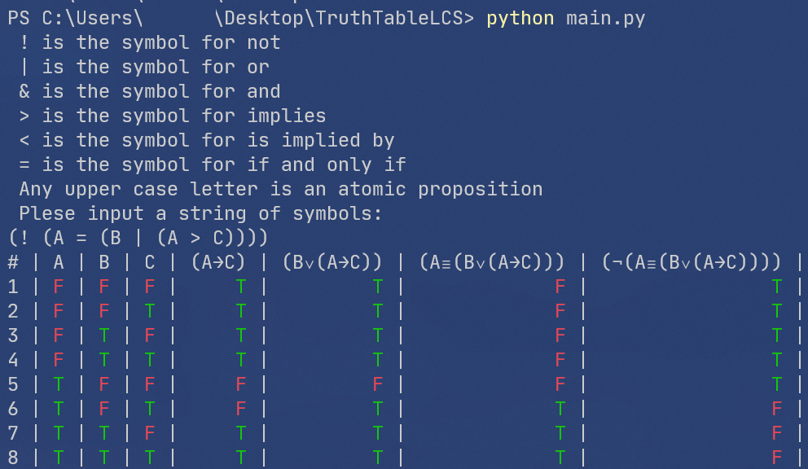

# TruthTableLCS

## Description

This program was created in order to help students from year 1 create truth tables for logic propositions.

## Logical Proposition

A logic proposition is defined as follows:

```text
LOGIC PROPOSITION: ATOM or EXPRESSION

ATOM: "A" or "B" or ... or "Z"

EXPRESSION: ONE PARAM EXPR or TWO PARAM EXPR

ONE PARAM EXPR: "(" and ONE PARAM OP and LOGIC PROPOSITION and ")"

ONE PARAM OP: NEGATION

NEGATION: "!" or "¬"

TWO PARAM EXPR: "(" and LOGIC PROPOSITION and TWO PARAM OP and LOGIC PROPOSITION and ")"

TWO PARAM OP: CONJUNCTION or DISJUNCTION or IMPLICATION or EQUIVALENCE

CONJUNCTION: "&" or "^" or "∧"

DISJUNCTION: "|" or "v" or "V" or "∨"

IMPLICATION: ">" or "→"

EQUIVALENCE: "=" or "≡"
```

Examples:

```text
A
(! A)
(! (A & B))
(A & (! B))
```

Spaces can be used between elements.

## Screenshot

