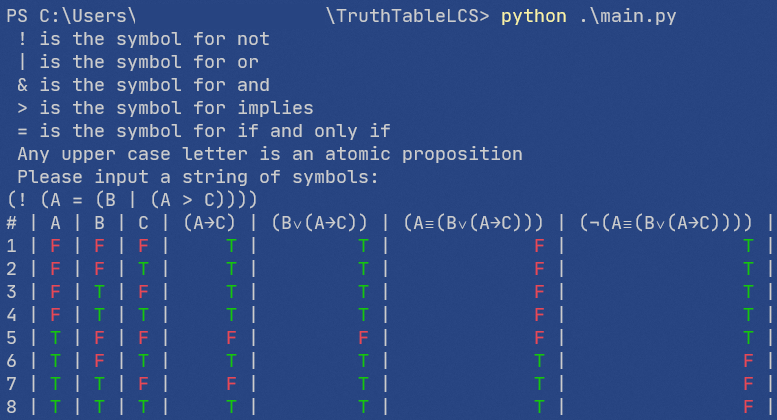
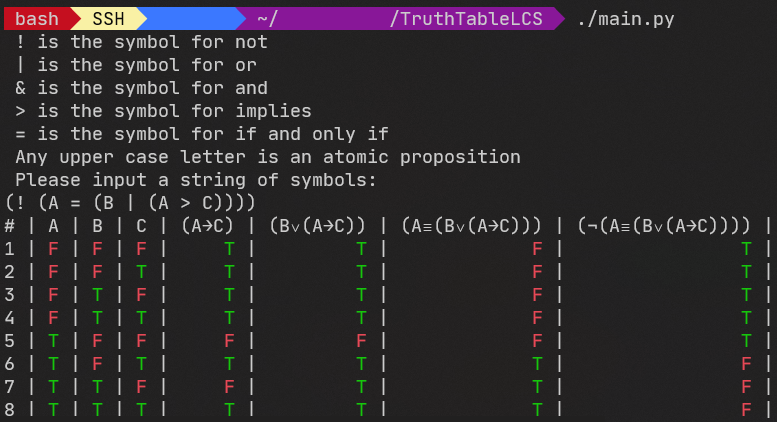
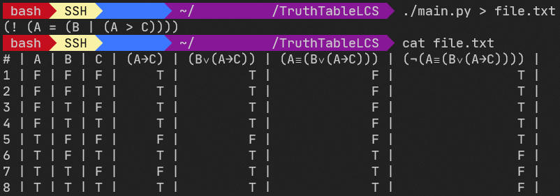

# TruthTableLCS

## Description

This program was created in order to help students from year 1 create truth tables for logic propositions.

## Logic Proposition

A logic proposition is defined as follows:

```text
LOGIC PROPOSITION: ATOM or EXPRESSION

ATOM: "A" or "B" or ... or "Z"

EXPRESSION: ONE PARAM EXPR or TWO PARAM EXPR

ONE PARAM EXPR: "(" and ONE PARAM OP and LOGIC PROPOSITION and ")"

ONE PARAM OP: NEGATION

NEGATION: "!" or "¬"

TWO PARAM EXPR: "(" and LOGIC PROPOSITION and TWO PARAM OP and LOGIC PROPOSITION and ")"

TWO PARAM OP: CONJUNCTION or DISJUNCTION or IMPLICATION or EQUIVALENCE

CONJUNCTION: "&" or "^" or "∧"

DISJUNCTION: "|" or "v" or "V" or "∨"

IMPLICATION: ">" or "→"

EQUIVALENCE: "=" or "≡"
```

Examples:

```text
A
(! A)
(! (A & B))
(A & (! B))
```

Spaces can be used between elements.

## Usage

The program should be run using Python 3.6 or higher, from the command line.

```powershell
# Windows
python main.py
```

```bash
# macOS or Linux
python3 main.py
# Or, if the main.py file is executable:
./main.py
```

The program will get the proposition from standard input and will print the truth table to standard output.

In order to save the output of the command to a text file, use the piping mechanism provided by your shell. In almost all shells, this is done like so:

```bash
python3 main.py > file.txt
```

**In PowerShell, however, piping does not support Unicode by default. Therefore, it must be done like so:**

```powershell
python main.py | Out-File 'file.txt' -Encoding OEM
```

If the standard output is piped to a file or if the `NO_COLOR` environment variable is set, colors will be disabled.

**On Windows, it is highly recommended to use a modern terminal, such as [Windows Terminal](https://aka.ms/terminal), [cmder](https://cmder.net/), [Hyper](https://hyper.is/) or others.** If not, colors will not be shown, and instead wrong characters will be displayed.

If installing an alternative terminal is not possible, please disable colors as follows:

```cmd
REM From cmd:
SET NO_COLOR=1
```

```powershell
# From powershell:
$Env:NO_COLOR = 1
```

## Generating spreadsheets

In order to generate spreadsheets in the `.xlsx` format, the `openpyxl` package is required. The best way to install it is to [install `pipenv`](https://pipenv.pypa.io/en/latest/install/#installing-pipenv) and then run the following commands to run the program:

```powershell
# Windows
pipenv install
pipenv run python excel.py file.xlsx
```

```bash
# macOS/Linux
pipenv install
pipenv run python3 excel.py file.xlsx
```

If you prefer not to install `pipenv`, manually install `openpyxl` from `pip` and then manually run the `excel.py` file, like so:

```powershell
# Windows

# Install openpyxl
pip install --user openpyxl

# Run the program
python excel.py file.xlsx
```

```bash
# macOS/Linux

# Install openpyxl
pip3 install --user openpyxl

# Run the program
./excel.py file.xlsx
```

## Screenshot






